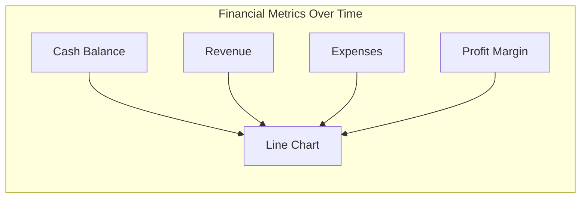
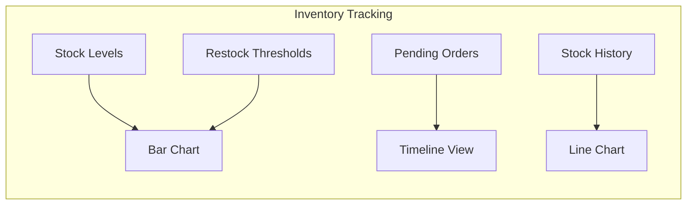
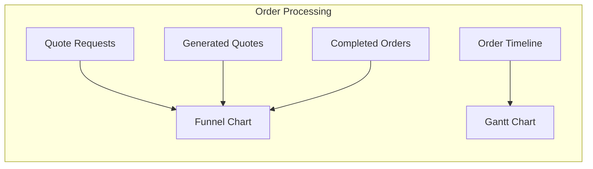

# Munder Difflin Paper Company Multi-Agent System Design

## Overview
This document outlines the design of a multi-agent system for Munder Difflin Paper Company to automate core business operations including inventory checks, quote generation, and order fulfillment. The system uses a maximum of 5 agents that communicate via text-based interactions to process customer requests efficiently.

## Agent Architecture

### 1. Orchestrator Agent
**Role**: Central coordinator that receives customer requests, delegates tasks to specialized agents, and manages the overall workflow.
**Responsibilities**:
- Parse incoming customer requests
- Extract key information (product types, quantities, delivery dates)
- Delegate tasks to appropriate specialized agents
- Collect responses from specialized agents
- Formulate final responses to customers
- Maintain conversation context

### 2. Inventory Agent
**Role**: Manages inventory-related operations and provides stock information.
**Responsibilities**:
- Check current stock levels for requested items
- Determine if restocking is needed based on minimum stock thresholds
- Calculate delivery timelines for out-of-stock items
- Provide inventory status reports to the Orchestrator

### 3. Quote Agent
**Role**: Generates price quotes for customer requests based on inventory data and historical quotes.
**Responsibilities**:
- Calculate costs for requested items
- Apply appropriate bulk discounts
- Reference historical quotes for similar requests
- Format quote explanations with clear breakdowns
- Round totals to appealing numbers
- Provide detailed quote information to the Orchestrator

### 4. Order Fulfillment Agent
**Role**: Processes approved orders and manages logistics.
**Responsibilities**:
- Create transactions for sales
- Arrange for restocking when inventory is low
- Calculate supplier delivery dates
- Update inventory after transactions
- Provide order status updates to the Orchestrator

### 5. Financial Agent
**Role**: Monitors financial aspects of transactions and provides financial reporting.
**Responsibilities**:
- Track cash balance
- Generate financial reports
- Calculate inventory valuation
- Identify top-selling products
- Provide financial insights to the Orchestrator

## System Workflow

1. **Request Reception**:
   - Customer submits a request for paper supplies
   - Orchestrator Agent receives the request and extracts key information

2. **Inventory Check**:
   - Orchestrator delegates to Inventory Agent
   - Inventory Agent checks stock levels for requested items
   - Inventory Agent returns availability status to Orchestrator

3. **Quote Generation**:
   - Orchestrator delegates to Quote Agent
   - Quote Agent calculates costs and applies appropriate discounts
   - Quote Agent references historical quotes for similar requests
   - Quote Agent returns detailed quote to Orchestrator

4. **Order Processing** (if quote is accepted):
   - Orchestrator delegates to Order Fulfillment Agent
   - Order Fulfillment Agent creates sales transactions
   - Order Fulfillment Agent arranges for restocking if needed
   - Order Fulfillment Agent returns order confirmation to Orchestrator

5. **Financial Reporting**:
   - Orchestrator delegates to Financial Agent
   - Financial Agent generates financial reports
   - Financial Agent returns financial status to Orchestrator

6. **Response Formulation**:
   - Orchestrator compiles information from all agents
   - Orchestrator formulates a comprehensive response to the customer

## Agent Tools and Functions

### Inventory Agent Tools:
- `get_all_inventory(as_of_date)`: Retrieve snapshot of available inventory
- `get_stock_level(item_name, as_of_date)`: Check stock level for specific item
- `check_restock_needs(item_name, quantity, as_of_date)`: Determine if restocking is needed
- `restock_inventory(as_of_date, buffer_multiplier)`: Restock items that are below their minimum stock levels

### Quote Agent Tools:
- `search_quote_history(search_terms, limit)`: Find similar historical quotes
- `calculate_bulk_discount(item_name, quantity)`: Apply appropriate bulk discounts
- `format_quote_explanation(items, quantities, prices, discounts)`: Create detailed quote explanation

### Order Fulfillment Agent Tools:
- `create_transaction(item_name, transaction_type, quantity, price, date)`: Record transactions
- `get_supplier_delivery_date(input_date_str, quantity)`: Calculate delivery dates
- `process_order(items, quantities, prices, date)`: Handle complete order processing

### Financial Agent Tools:
- `get_cash_balance(as_of_date)`: Check current cash balance
- `generate_financial_report(as_of_date)`: Create comprehensive financial report

## System Flow Diagram

```mermaid
graph TD
    Customer[Customer Request] --> Orchestrator

    Orchestrator[Orchestrator Agent] --> Inventory[Inventory Agent]
    Orchestrator --> Quote[Quote Agent]
    Orchestrator --> Order[Order Fulfillment Agent]
    Orchestrator --> Financial[Financial Agent]

    Inventory --> Orchestrator
    Quote --> Orchestrator
    Order --> Orchestrator
    Financial --> Orchestrator

    %% Inventory Agent Tools
    Inventory --> GetAllInventory[get_all_inventory]
    Inventory --> GetStockLevel[get_stock_level]
    Inventory --> CheckRestockNeeds[check_restock_needs]

    %% Quote Agent Tools
    Quote --> SearchQuoteHistory[search_quote_history]
    Quote --> CalculateBulkDiscount[calculate_bulk_discount]
    Quote --> FormatQuoteExplanation[format_quote_explanation]

    %% Order Fulfillment Agent Tools
    Order --> CreateTransaction[create_transaction]
    Order --> GetSupplierDeliveryDate[get_supplier_delivery_date]
    Order --> ProcessOrder[process_order]

    %% Financial Agent Tools
    Financial --> GetCashBalance[get_cash_balance]
    Financial --> GenerateFinancialReport[generate_financial_report]

    %% Tool styles
    classDef tool fill:#f9f,stroke:#333,stroke-width:1px;
    class GetAllInventory,GetStockLevel,CheckRestockNeeds,SearchQuoteHistory,CalculateBulkDiscount,FormatQuoteExplanation,CreateTransaction,GetSupplierDeliveryDate,ProcessOrder,GetCashBalance,GenerateFinancialReport tool;
```

## Implementation Considerations

1. **Error Handling**: Each agent should implement robust error handling to manage unexpected inputs or system failures.

2. **Context Management**: The Orchestrator Agent must maintain context throughout the conversation to ensure coherent responses.

3. **Bulk Discounts**: The Quote Agent should implement a consistent approach to bulk discounts based on order size and item type.

4. **Date Handling**: All agents must properly parse and format dates to ensure accurate delivery estimates and transaction records.

5. **Performance Optimization**: The system should minimize database queries by batching requests when possible.

6. **Scalability**: The design allows for future expansion of agent capabilities without disrupting the overall architecture.

## Testing Strategy

The system will be tested using the provided `quote_requests_sample.csv` file, which contains a variety of customer requests. The test harness in `run_test_scenarios()` will evaluate:

1. Correct parsing of customer requests
2. Accurate inventory checking
3. Appropriate quote generation with bulk discounts
4. Proper order fulfillment and transaction recording
5. Accurate financial reporting

Test results will be logged to `test_results.csv` for analysis and verification.

## Test Result Visualization

To effectively track the system's performance and state changes over time, we will implement visualizations for key metrics:

### Financial State Visualization

- **Cash Flow Dashboard**: Track cash balance changes after each transaction
- **Revenue vs. Expenses**: Compare income from sales against costs of restocking
- **Profit Margin Analysis**: Visualize profit margins by product category
- **Transaction Volume**: Monitor transaction frequency and volume over time

### Inventory State Visualization

- **Stock Level Indicators**: Color-coded visualization of current stock vs. minimum thresholds
- **Inventory Turnover**: Track how quickly different products are selling
- **Restock Predictions**: Forecast when items will need restocking based on sales trends
- **Category Distribution**: Visualize inventory distribution across product categories

### Order State Visualization

- **Order Status Dashboard**: Track orders from quote request to fulfillment
- **Processing Time Metrics**: Measure and visualize time spent in each stage of order processing
- **Fulfillment Rate**: Compare quote requests to completed orders
- **Seasonal Trends**: Identify patterns in order volume and types over time

### Implementation Approach

The visualization system will be implemented using:

1. **Data Collection**: Capture state changes at each step of the multi-agent process
2. **Time-Series Database**: Store historical state data with timestamps
3. **Visualization Library**: Use libraries like Matplotlib, Plotly, or D3.js for interactive charts
4. **Real-Time Updates**: Refresh visualizations as new transactions occur
5. **Exportable Reports**: Generate PDF or interactive HTML reports for stakeholders

These visualizations will provide valuable insights into system performance, help identify bottlenecks, and support data-driven decision-making for inventory management and business operations.
