# Munder Difflin Paper Company Multi-Agent System Design

## Overview
This document outlines the design of a multi-agent system for Munder Difflin Paper Company to automate core business operations including inventory checks, quote generation, and order fulfillment. The system uses a maximum of 5 agents that communicate via text-based interactions to process customer requests efficiently.

## Agent Architecture

### 1. Orchestrator Agent
**Role**: Central coordinator that receives customer requests, delegates tasks to specialized agents, and manages the overall workflow.
**Responsibilities**:
- Parse incoming customer requests.
- Extract key information (product types, quantities, delivery dates).
- Delegate tasks to appropriate specialized agents.
- Collect responses from specialized agents.
- Formulate final responses to customers.
- Maintain conversation context.

### 2. Inventory Agent
**Role**: Manages inventory-related operations and provides stock information.
**Responsibilities**:
- Check current stock levels for requested items.
- Determine if restocking is needed based on minimum stock thresholds.
- Generate comprehensive inventory reports.
- Provide inventory status reports to the Orchestrator.

### 3. Quote Agent
**Role**: Generates price quotes for customer requests based on inventory data and historical quotes.
**Responsibilities**:
- Calculate costs for requested items.
- Apply appropriate bulk discounts.
- Reference historical quotes for similar requests.
- Provide detailed quote information to the Orchestrator.

### 4. Order Fulfillment Agent
**Role**: Processes approved orders and manages logistics.
**Responsibilities**:
- Create transactions for sales.
- Arrange for restocking when inventory is low.
- Calculate supplier delivery dates.
- Update inventory after transactions.
- Provide order status updates to the Orchestrator.

### 5. Financial Agent
**Role**: Monitors financial aspects of transactions and provides financial reporting.
**Responsibilities**:
- Track cash balance.
- Generate financial reports.
- Identify top-selling products.
- Provide financial insights to the Orchestrator.

## System Workflow

1.  **Request Reception**:
    -   A customer submits a request for paper supplies.
    -   The Orchestrator Agent receives the request and uses its `parse_request` tool to extract key information.

2.  **Inventory Check**:
    -   The Orchestrator delegates to the Inventory Agent to check stock levels for the requested items.
    -   The Inventory Agent uses its `check_inventory_status` tool and returns the availability status to the Orchestrator.

3.  **Quote Generation**:
    -   The Orchestrator delegates to the Quote Agent.
    -   The Quote Agent uses `search_quote_history` to find similar past orders and `calculate_bulk_discount` to determine costs and apply appropriate discounts.
    -   The Quote Agent returns a detailed quote to the Orchestrator.

4.  **Order Processing** (if a quote is accepted):
    -   The Orchestrator delegates to the Order Fulfillment Agent.
    -   The Order Fulfillment Agent uses the `process_order` tool to create sales transactions and arrange for restocking if needed.
    -   The agent returns an order confirmation to the Orchestrator.

5.  **Financial Reporting**:
    -   The Orchestrator can delegate to the Financial Agent to get financial status reports using the `get_financial_status` tool.
    -   The Financial Agent returns the financial status to the Orchestrator.

6.  **Response Formulation**:
    -   The Orchestrator compiles information from all agents to formulate a comprehensive response to the customer.

## Agent Tools and Functions

### Common Tool for All Agents:
- `get_available_paper_supplies()`: Returns a list of all available paper supply item names from the `paper_supplies` list.

### Orchestrator Agent Tools:
- `parse_request(request)`: Parses a customer request to extract key information like items, quantities, and dates.

### Inventory Agent Tools:
- `check_inventory_status(item_name, quantity, as_of_date)`: Checks if a requested item is available in sufficient quantity.
- `get_inventory_report(as_of_date)`: Generates a comprehensive inventory report.
- `restock_inventory(as_of_date, buffer_multiplier)`: Restocks items that are below their minimum stock levels.

### Quote Agent Tools:
- `search_quote_history(search_terms, limit)`: Finds similar historical quotes to inform pricing.
- `calculate_bulk_discount(item_name, quantity)`: Calculates and applies appropriate bulk discounts based on quantity.

### Order Fulfillment Agent Tools:
- `process_order(items, order_date)`: Processes an order by creating sales transactions and arranging for restocking if needed.
- `get_supplier_delivery_date(input_date_str, quantity)`: Calculates estimated delivery dates from suppliers for restocked items.

### Financial Agent Tools:
- `get_financial_status(as_of_date)`: Gets comprehensive financial status information, including cash balance, inventory value, and recent performance.
- `get_cash_balance(as_of_date)`: Checks the current cash balance.

## High-Level System Flow

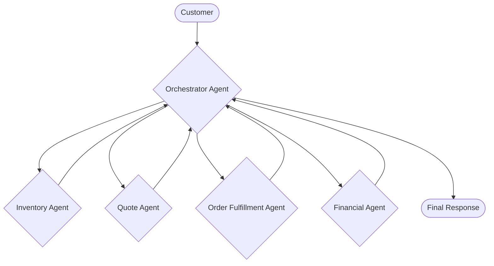

## Agent-Specific Diagrams

### Orchestrator Agent
The Orchestrator Agent is the central hub of the system. It parses customer requests and delegates tasks to the appropriate specialized agents.

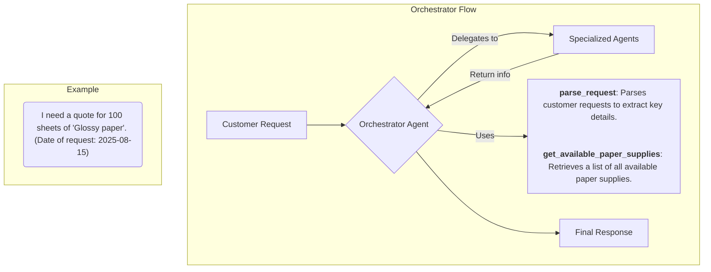

### Inventory Agent
The Inventory Agent manages all stock-related inquiries. It interacts with the database to check stock levels, generate reports, and handle restocking.

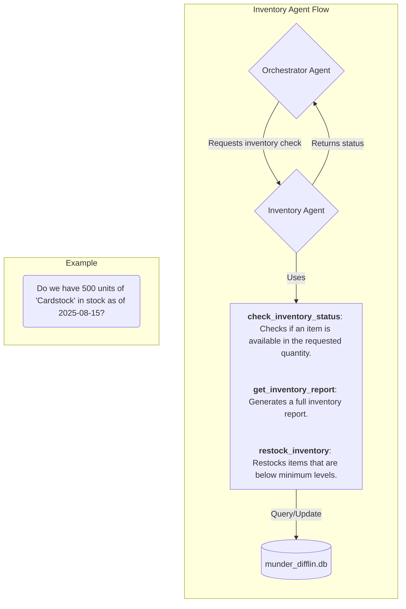

### Quote Agent
The Quote Agent is responsible for generating price quotes. It references historical data and applies discounts to provide accurate pricing.

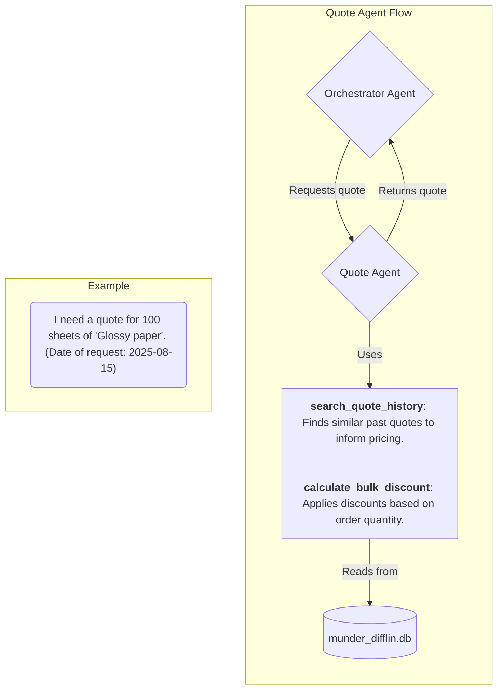

### Order Fulfillment Agent
This agent processes orders, creating sales transactions and managing the restocking process when necessary.

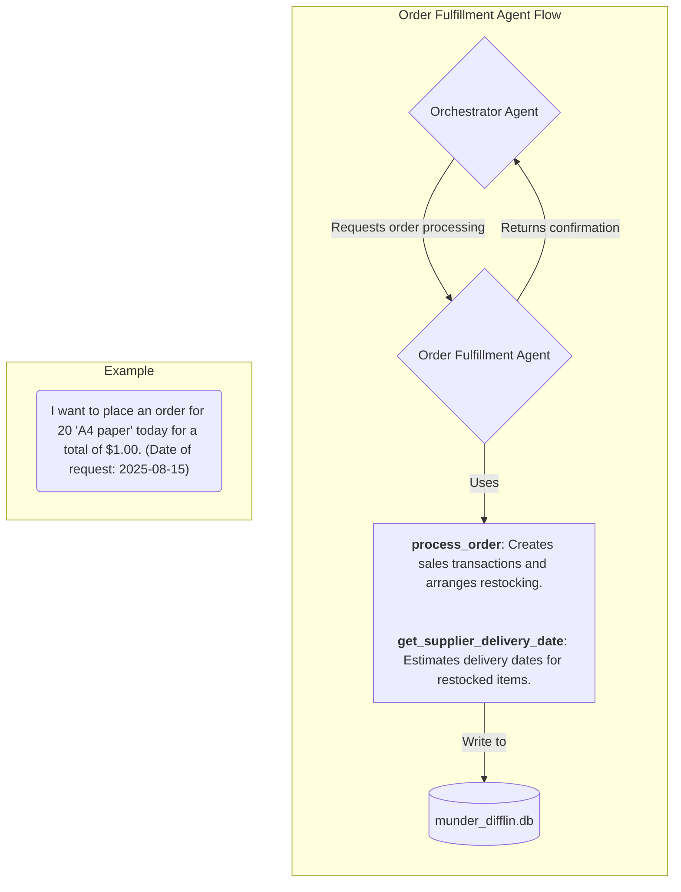

### Financial Agent
The Financial Agent provides insights into the company's financial health by tracking cash flow, inventory value, and overall performance.

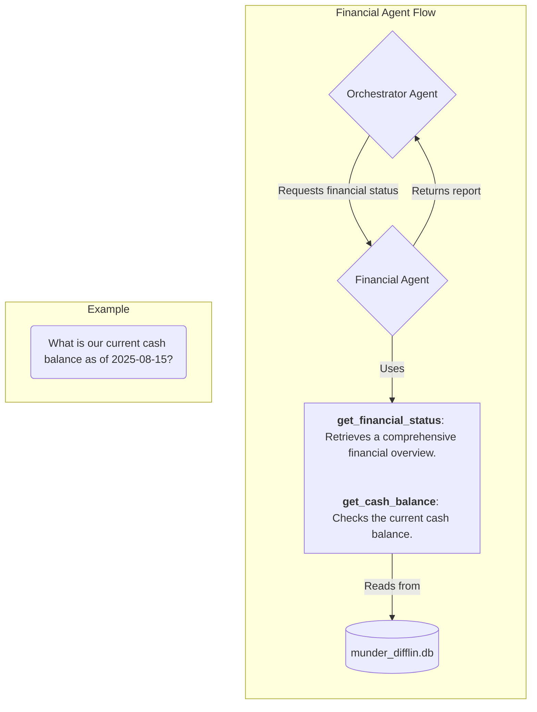
## Put it all together!
If we put all the agents and their tools together, our system looks like the diagram below.
```mermaid
graph TD
    subgraph Customer
        direction LR
        CustomerRequest[Customer Request]
    end

    subgraph Multi-Agent System
        direction TB
        Orchestrator[Orchestrator Agent]

        subgraph Specialized Agents
            direction LR
            Inventory[Inventory Agent]
            Quote[Quote Agent]
            Order[Order Fulfillment Agent]
            Financial[Financial Agent]
        end

        %% Connections
        CustomerRequest --> Orchestrator

        Orchestrator --> Inventory
        Orchestrator --> Quote
        Orchestrator --> Order
        Orchestrator --> Financial

        Inventory --> Orchestrator
        Quote --> Orchestrator
        Order --> Orchestrator
        Financial --> Orchestrator
    end

    subgraph Tools
        direction TB
        %% Orchestrator Tools
        subgraph Orchestrator Tools
            ParseRequest[parse_request]
        end

        %% Inventory Tools
        subgraph Inventory Tools
            CheckInventoryStatus[check_inventory_status]
            GetInventoryReport[get_inventory_report]
            RestockInventory[restock_inventory]
        end

        %% Quote Tools
        subgraph Quote Tools
            SearchQuoteHistory[search_quote_history]
            CalculateBulkDiscount[calculate_bulk_discount]
        end

        %% Order Tools
        subgraph Order Tools
            ProcessOrder[process_order]
            GetSupplierDeliveryDate[get_supplier_delivery_date]
        end

        %% Financial Tools
        subgraph Financial Tools
            GetFinancialStatus[get_financial_status]
            GetCashBalance[get_cash_balance]
        end

        %% Common Tool
        subgraph Common Tool
            GetAvailablePaperSupplies[get_available_paper_supplies]
        end
    end

    %% Tool Connections
    Orchestrator -- "Uses" --> ParseRequest
    Orchestrator -- "Uses" --> GetAvailablePaperSupplies

    Inventory -- "Uses" --> CheckInventoryStatus
    Inventory -- "Uses" --> GetInventoryReport
    Inventory -- "Uses" --> RestockInventory
    Inventory -- "Uses" --> GetAvailablePaperSupplies

    Quote -- "Uses" --> SearchQuoteHistory
    Quote -- "Uses" --> CalculateBulkDiscount
    Quote -- "Uses" --> GetAvailablePaperSupplies

    Order -- "Uses" --> ProcessOrder
    Order -- "Uses" --> GetSupplierDeliveryDate
    Order -- "Uses" --> GetAvailablePaperSupplies

    Financial -- "Uses" --> GetFinancialStatus
    Financial -- "Uses" --> GetCashBalance
    Financial -- "Uses" --> GetAvailablePaperSupplies

    
```

## Agent Tool Flow Diagrams

The following diagrams illustrate the tool flow for each specialized agent, showing how they interact with their respective tools and the central database.

### Inventory Agent Tool Flow
The Inventory Agent uses its tools to check stock, generate reports, and restock items.
- **`check_inventory_status`**: Called when a customer asks if an item is in stock.
- **`get_inventory_report`**: Called when a user asks for a list of all items in inventory.
- **`restock_inventory`**: Called when a customer order cannot be fulfilled due to low stock.

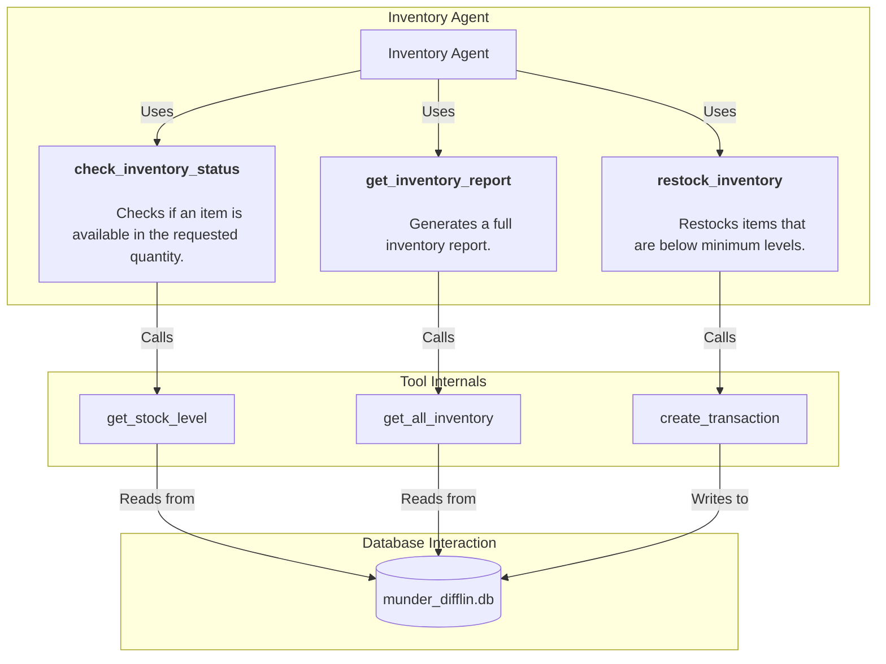

### Quote Agent Tool Flow
The Quote Agent provides pricing information to customers.
- **`search_quote_history`**: Called when a customer asks for a quote to see if a similar quote has been requested in the past.
- **`calculate_bulk_discount`**: Called when a customer asks for a quote with a large quantity.

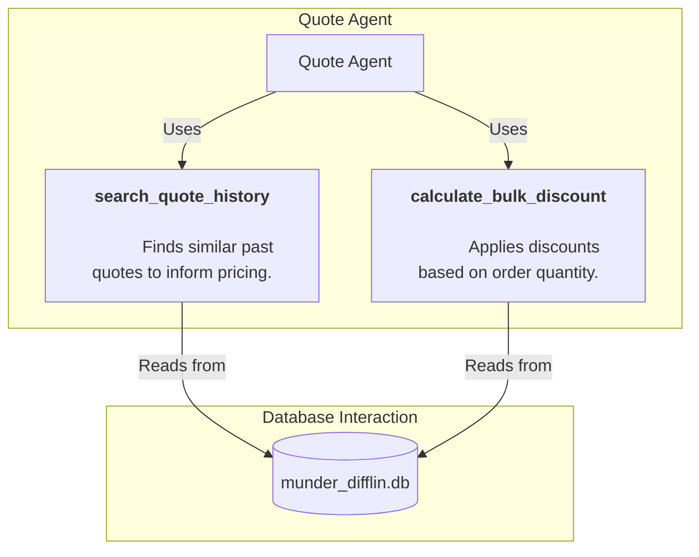

### Order Fulfillment Agent Tool Flow
The Order Fulfillment Agent processes customer orders.
- **`process_order`**: Called when a customer confirms they want to place an order.
- **`get_supplier_delivery_date`**: Called when a customer asks for a delivery date.

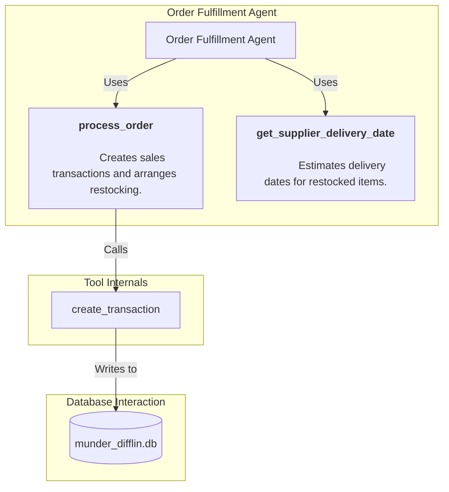

### Financial Agent Tool Flow
The Financial Agent provides financial information about the company.
- **`get_financial_status`**: Called when a user asks for a financial overview of the company.
- **`get_cash_balance`**: Called when a user asks for the current cash balance.

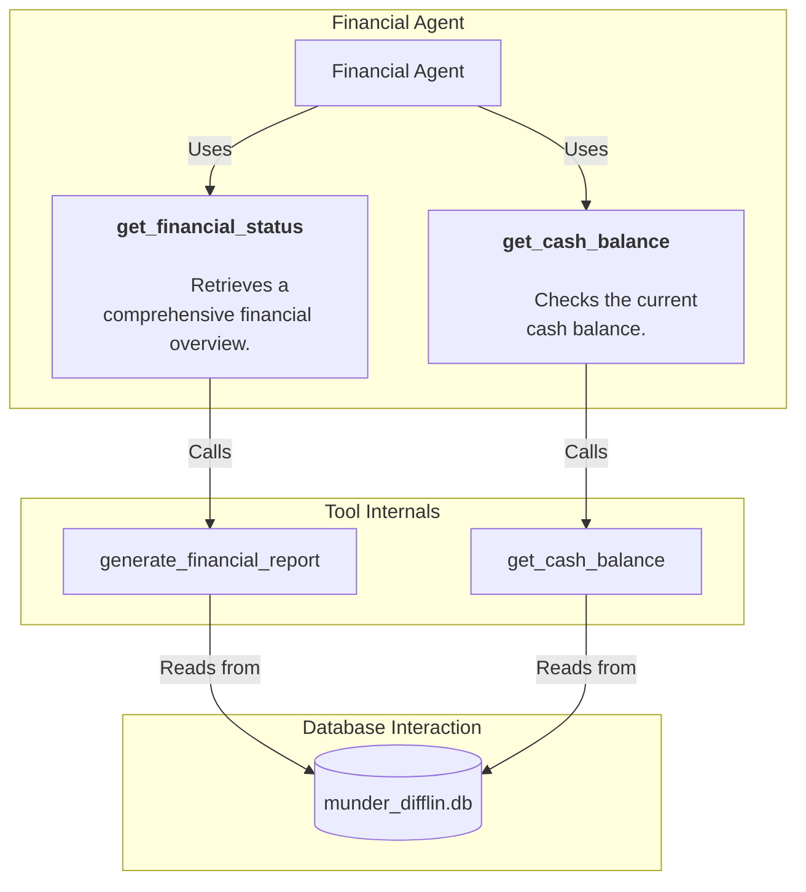

## Instruction Prompting

To interact with the multi-agent system, prompts should be clear and provide necessary context. The agents are instructed to perform best with specific information:

-   **Use Exact Item Names**: The agents perform best when using the exact item names found in the `paper_supplies` list. The `get_available_paper_supplies()` tool can be used to retrieve a list of valid names. For example, use `"Standard copy paper"` instead of `"copy paper"`. The orchestrator will attempt to map common names to the correct item, but being specific yields better results.
-   **Specify Dates**: Always include the date of the request in your prompt (e.g., `(Date of request: YYYY-MM-DD)`). This is crucial for accurate inventory checks, financial reporting, and delivery estimates.
-   **Be Clear and Direct**: Formulate requests clearly. For example:
    -   **For a quote**: `"I need a quote for 100 sheets of 'Glossy paper' and 50 'Envelopes'. (Date of request: 2025-08-15)"`
    -   **To place an order**: `"I want to place an order for 20 'A4 paper' today. The total price is $1.00. (Date of request: 2025-08-15)"`
    -   **For inventory status**: `"Do we have 500 units of 'Cardstock' in stock as of 2025-08-15?"`

## Implemented Result

The project is executed via the `run_test_scenarios` function in `project_starter.py`. This function simulates a series of customer requests and demonstrates the end-to-end functionality of the multi-agent system.

The process is as follows:
1.  **Database Initialization**: The `init_database()` function sets up the SQLite database, creating tables for transactions, quotes, and inventory, and seeding them with initial data.
2.  **Test Data Loading**: The `run_test_scenarios` function loads customer requests from `quote_requests_sample.csv`.
3.  **Request Processing**: Each request is passed to the `orchestrator` agent, which coordinates with the other specialized agents (Inventory, Quote, Order, Financial) to fulfill the request.
4.  **Logging**: All interactions, tool calls, and agent responses are logged to `project_output.log`, providing a detailed trace of the system's execution.
5.  **Results Output**: The final response for each test scenario, along with the cash balance and inventory value at that point in time, is saved to `test_results.csv`. This file provides a summary of the system's performance across the test cases.

This implementation provides a robust framework for automating business processes, with clear logging and result tracking for evaluation and debugging.
